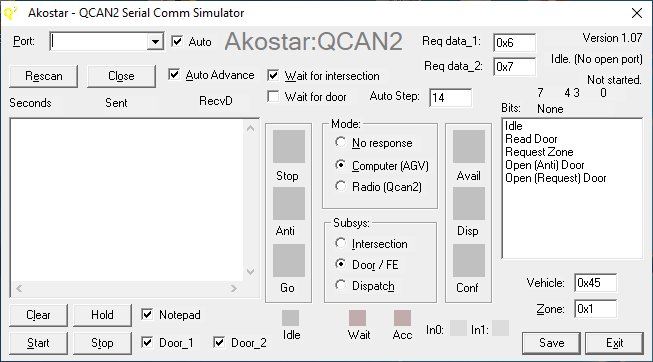

# QCAN2

QCAN2 AGV unit support

 On this site one can find QCAN2 updated documentation.

 The file is available in multiple formats. The original .odt format and the .pdf format.

 To view the documentation, click on the (above) file named:

   **QCAN2_manual_master_onedoc.pdf**

 The files can be viewed in the browser, and can be downloaded for offline viewing. The file is also available in an editable format.

## Windows test utility screen shot

#### Disclaimer:

  Access given to this folder to allow our customers to see the most up to
date documentation and utilities. Given this purpose, the documents are under
constant revision, and no claims are made to the accuracy and correctness of the
contents of this folder and its sub entities. These documents are considered un-authoritative.
Should authoritative documents be needed, please reference the documents
delivered with the product.

